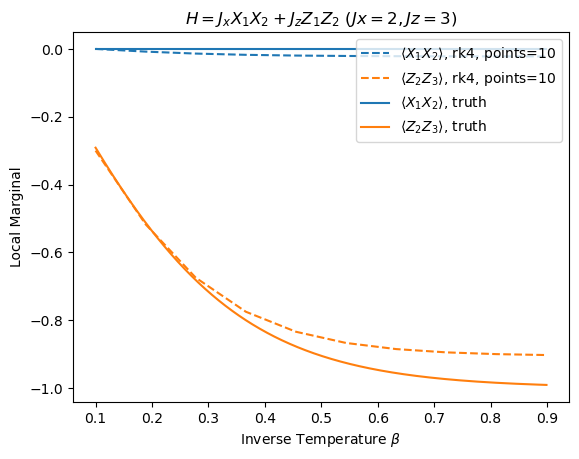

In this repository, we open-source sample codes that were developed by me to simulate the simulate the spatial energy distribution as a function of temperature in equilibrium quantum systems: [technical report](https://sriramgkn.github.io/reports/Report_ram_revision1.pdf)

Below we depict the spatial energy distribution as a function of temperature of a 3-qubit system maintained in thermal equilibrium, characterized by two "local marginals" (localized energy on 2-qubit subsystems). The solid lines are theoretical expectations, while the dashed lines represent a numerical approximation of the same by evolving our theory (an [Initial Value Problem](https://en.wikipedia.org/wiki/Initial_value_problem)) using the [RK4 algorithm](https://en.wikipedia.org/wiki/Runge%E2%80%93Kutta_methods).

